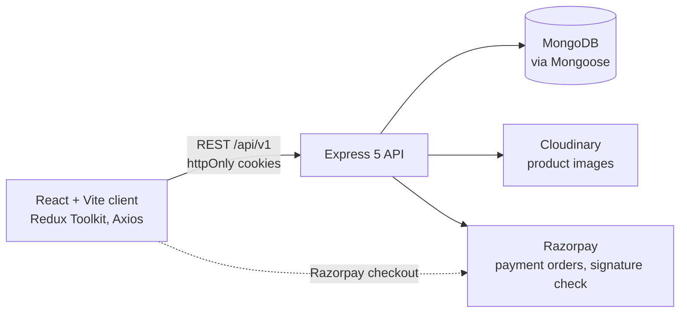
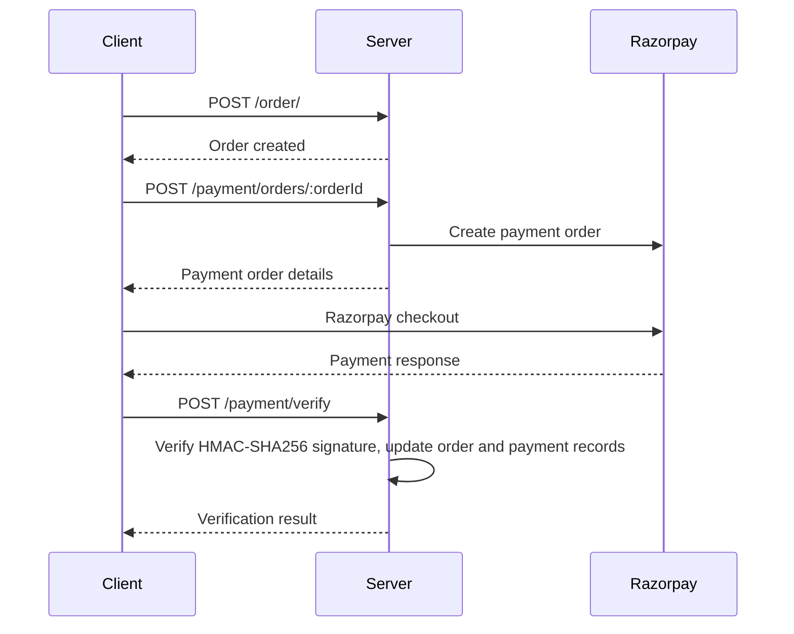

<div align="center">

# NexCart

**A full-stack e-commerce platform with role-based access, seller product management, and Razorpay payments.**


</div>

<!-- Add screenshots to docs/screenshots/ and reference them here. -->

## Table of Contents

- [Overview](#overview)
- [Features](#features)
- [Tech Stack](#tech-stack)
- [Architecture](#architecture)
- [Project Structure](#project-structure)
- [Getting Started](#getting-started)
- [Environment Variables](#environment-variables)
- [Available Scripts](#available-scripts)
- [API Reference](#api-reference)
- [Authentication Flow](#authentication-flow)
- [Payment Flow](#payment-flow)
- [Security Notes](#security-notes)
- [Known Limitations](#known-limitations)
- [Development Workflow](#development-workflow)
- [Documentation](#documentation)

## Overview

NexCart is a full-stack e-commerce application with three roles (`USER`, `SELLER`, `ADMIN`). Buyers browse products, manage a cart and addresses, place orders, and pay through Razorpay. Sellers list products with images hosted on Cloudinary. The frontend is a React + Vite single-page app, and the backend is an Express + MongoDB REST API.

## Features

**Everyone**

- Register and log in with JWT access and refresh tokens stored in httpOnly cookies
- Browse, search, and filter products, and view product details with image carousels

**Buyers**

- Shopping cart: add products, reduce quantities, remove items
- Orders: create from the cart, list, view details, cancel
- Checkout with Razorpay and server-side signature verification
- Address book (up to 5 addresses)
- Profile and password management

**Sellers**

- Upgrade a user account to the seller role
- Add products with up to 5 images (uploaded to Cloudinary), view listings, delete products

**Admin**

- Admin panel views: dashboard, features, products, and orders (see [Known Limitations](#known-limitations))

**Platform**

- Role-based route protection on both client and server

## Tech Stack

| Layer    | Technologies                                                            |
| -------- | ----------------------------------------------------------------------- |
| Frontend | React 19, Vite, Tailwind CSS 4, Redux Toolkit, React Router, Axios      |
| UI       | shadcn/ui, Radix UI, Lucide Icons, Tabler Icons, Embla Carousel, Sonner |
| Backend  | Node.js, Express 5, Mongoose (MongoDB), JWT, bcrypt, multer             |
| Services | Cloudinary (image hosting), Razorpay (payments)                         |
| Tooling  | Nodemon, ESLint, Prettier                                               |

## Architecture



## Project Structure

```text
e-Commerce/
├── client/                  # React + Vite frontend
│   └── src/
│       ├── api/             # Axios instance and interceptors
│       ├── app/             # Redux store
│       ├── assets/          # Images, logos, SVGs
│       ├── components/      # admin, auth, common, seller, shopping, ui (shadcn/ui)
│       ├── config/          # Form field configurations
│       ├── features/        # Redux slices and thunks (auth, seller, shopping)
│       ├── lib/             # Utilities
│       ├── pages/           # Route-level screens (admin, auth, error, seller, shopping)
│       ├── App.jsx          # Route definitions
│       └── main.jsx         # Entry point
├── server/                  # Express API
│   └── src/
│       ├── controllers/     # Request handlers
│       ├── db/              # MongoDB connection
│       ├── middleware/      # JWT verification, error handler, file upload
│       ├── models/          # Mongoose schemas
│       ├── routes/          # Route definitions per resource
│       ├── services/        # Razorpay SDK wrapper
│       ├── utils/           # Error/response helpers, Cloudinary helpers
│       ├── app.js           # Express app (middleware, routes, CORS)
│       ├── constants.js     # App constants (database name)
│       └── index.js         # Entry point (DB connect, then listen)
├── docs/                    # API reference, architecture, full folder tree
└── Readme.md
```

## Getting Started

### Prerequisites

- **Node.js** (current LTS) and npm
- **MongoDB** instance (local or Atlas)
- **Cloudinary** account for image uploads
- **Razorpay** account for payments (test-mode keys work for development)

### Installation

```bash
git clone <repository-url>
cd e-Commerce

# Backend
cd server
npm install

# Frontend
cd ../client
npm install
```

### Configure and run

1. Create `server/.env` using the [template below](#environment-variables) and fill in your values.
2. Start the backend from `server/`:
   ```bash
   npm run dev
   ```
3. Start the frontend from `client/` in a second terminal:
   ```bash
   npm run dev
   ```

| Service  | URL                                    |
| -------- | -------------------------------------- |
| Client   | `http://localhost:5173` (Vite default) |
| Server   | `http://localhost:8000`                |
| API base | `http://localhost:8000/api/v1`         |

## Environment Variables

All variables are set in `server/.env`. There is no `.env.example` in the repo, so create the file from this template. Never commit real values.

```dotenv
PORT=8000
MONGODB_URI=
CORS_ORIGIN=http://localhost:5173

ACCESS_TOKEN_SECRET=
ACCESS_TOKEN_EXPIRY=15m
REFRESH_TOKEN_SECRET=
REFRESH_TOKEN_EXPIRY=7d

CLOUDINARY_CLOUD_NAME=
CLOUDINARY_API_KEY=
CLOUDINARY_API_SECRET=

RAZORPAY_KEY_ID=
RAZORPAY_KEY_SECRET=
```

| Variable                                                               | Description                                                                                    |
| ---------------------------------------------------------------------- | ---------------------------------------------------------------------------------------------- |
| `PORT`                                                                 | Server port (defaults to `8000`)                                                               |
| `MONGODB_URI`                                                          | MongoDB connection string                                                                      |
| `CORS_ORIGIN`                                                          | Allowed client origin. The client sends credentials, so this must be the exact origin, not `*` |
| `ACCESS_TOKEN_SECRET`                                                  | Secret used to sign access tokens                                                              |
| `ACCESS_TOKEN_EXPIRY`                                                  | Access token lifetime (e.g. `15m`)                                                             |
| `REFRESH_TOKEN_SECRET`                                                 | Secret used to sign refresh tokens                                                             |
| `REFRESH_TOKEN_EXPIRY`                                                 | Refresh token lifetime (e.g. `7d`)                                                             |
| `CLOUDINARY_CLOUD_NAME`, `CLOUDINARY_API_KEY`, `CLOUDINARY_API_SECRET` | Cloudinary credentials                                                                         |
| `RAZORPAY_KEY_ID`, `RAZORPAY_KEY_SECRET`                               | Razorpay credentials                                                                           |

The client reads no environment variables. Its API base URL is set in `client/src/api/api.js`. The MongoDB database name is defined in `server/src/constants.js`.

## Available Scripts

| Location  | Command           | Description                                         |
| --------- | ----------------- | --------------------------------------------------- |
| `server/` | `npm run dev`     | Start the API with Nodemon (`nodemon src/index.js`) |
| `client/` | `npm run dev`     | Start the Vite dev server                           |
| `client/` | `npm run build`   | Create a production build                           |
| `client/` | `npm run preview` | Preview the production build locally                |
| `client/` | `npm run lint`    | Run ESLint                                          |

## API Reference

Base URL: `http://localhost:8000/api/v1`. 🔒 means a valid JWT (cookie) is required. The full reference is in [`docs/api-endpoints.md`](docs/api-endpoints.md).

<details>
<summary><strong>View all endpoints</strong></summary>

| Method | Endpoint                      | Auth | Description                                |
| ------ | ----------------------------- | ---- | ------------------------------------------ |
| POST   | `/auth/register`              | –    | Register a new user                        |
| POST   | `/auth/login`                 | –    | Log in (tokens returned as cookies)        |
| POST   | `/auth/logout`                | 🔒   | Log out and clear tokens                   |
| POST   | `/auth/refresh`               | –    | Issue a new access and refresh token pair  |
| GET    | `/auth/check-auth`            | 🔒   | Verify authentication status               |
| GET    | `/users/me`                   | 🔒   | Get the current user's profile             |
| PATCH  | `/users/me`                   | 🔒   | Update account details                     |
| PATCH  | `/users/me/password`          | 🔒   | Change password                            |
| PATCH  | `/users/me/role`              | 🔒   | Upgrade role to `SELLER`                   |
| POST   | `/addresses/add`              | 🔒   | Add an address (max 5)                     |
| GET    | `/addresses/`                 | 🔒   | List addresses (paginated)                 |
| GET    | `/addresses/:addressId`       | 🔒   | Get an address                             |
| PATCH  | `/addresses/:addressId`       | 🔒   | Update an address                          |
| DELETE | `/addresses/:addressId`       | 🔒   | Delete an address                          |
| GET    | `/shop/products`              | –    | List products (search, filter, paginate)   |
| GET    | `/shop/:productId`            | –    | Get product details                        |
| POST   | `/seller/products/add`        | –    | Add a product with images (multipart)      |
| GET    | `/seller/products`            | –    | List the seller's products                 |
| DELETE | `/seller/products/:productId` | –    | Delete a product and its Cloudinary images |
| GET    | `/cart/`                      | 🔒   | Get cart contents                          |
| POST   | `/cart/:productId`            | 🔒   | Add a product to the cart                  |
| PATCH  | `/cart/:productId`            | 🔒   | Reduce product quantity                    |
| DELETE | `/cart/:productId`            | 🔒   | Remove a product from the cart             |
| POST   | `/order/`                     | 🔒   | Create an order from the cart              |
| GET    | `/order/`                     | 🔒   | List the user's orders                     |
| GET    | `/order/:orderId`             | 🔒   | Get order details                          |
| PATCH  | `/order/:orderId/cancel`      | 🔒   | Cancel an order                            |
| POST   | `/payment/orders/:orderId`    | 🔒   | Create a Razorpay payment order            |
| POST   | `/payment/verify`             | 🔒   | Verify the Razorpay payment signature      |

</details>

## Authentication Flow

1. The user registers or logs in, and the server returns `accessToken` and `refreshToken` as httpOnly cookies.
2. The client sends cookies with every request (`withCredentials: true`).
3. The `verifyJWT` middleware validates the access token on protected routes.
4. On a `401`, the Axios interceptor calls `/auth/refresh` to get a new token pair.
5. If the refresh also fails, client state is cleared and the user is redirected to login.

## Payment Flow



## Security Notes

- Tokens are stored in httpOnly cookies and never exposed to client-side JavaScript.
- Passwords are hashed with bcrypt.
- Payment signatures are verified on the server with HMAC-SHA256 using `RAZORPAY_KEY_SECRET`.
- Secrets live only in `server/.env`. Do not commit them.

## Known Limitations

- The review controller exists, but no review routes are registered, so reviews are not reachable through the API.
- The admin panel views have no admin API endpoints behind them yet.
- Sellers can add, list, and delete products, but there is no product edit endpoint.
- The client's API base URL is hardcoded in `client/src/api/api.js`. Make it configurable before deploying anywhere other than local development.

## Development Workflow

Branches: `main` (stable) ← `develop` (integration) ← `feature/*` (e.g. `feature/cart`). Changes move `feature/*` → `develop` → `main` through pull requests.

## Documentation

- [`docs/api-endpoints.md`](docs/api-endpoints.md): full API reference
- [`docs/architecture.md`](docs/architecture.md): architecture notes
- [`docs/folder_structure.md`](docs/folder_structure.md): complete directory trees
