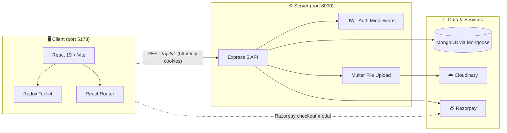
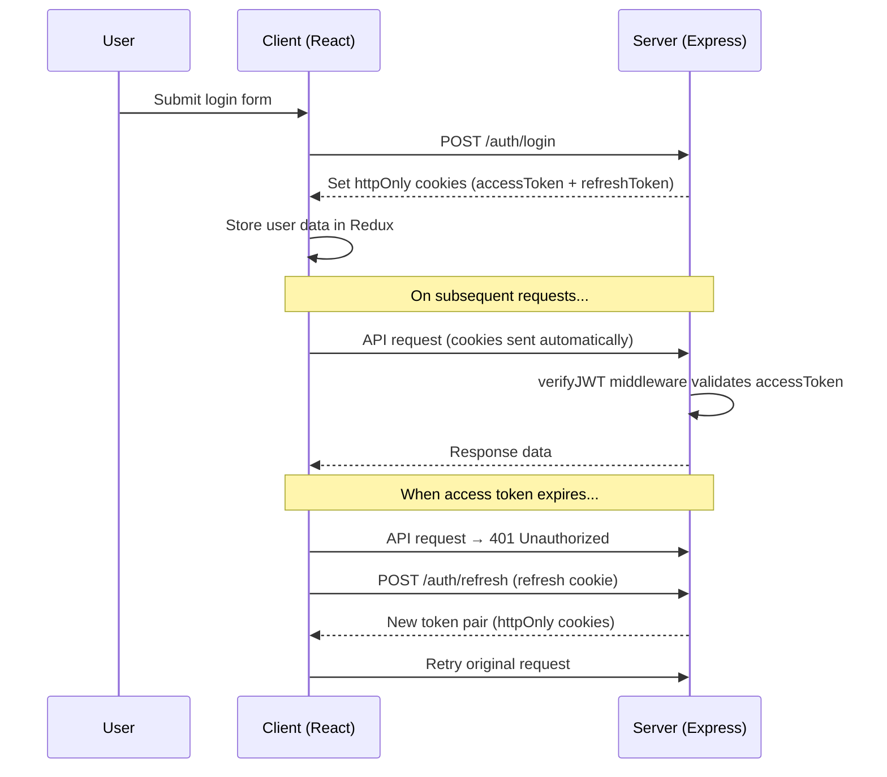
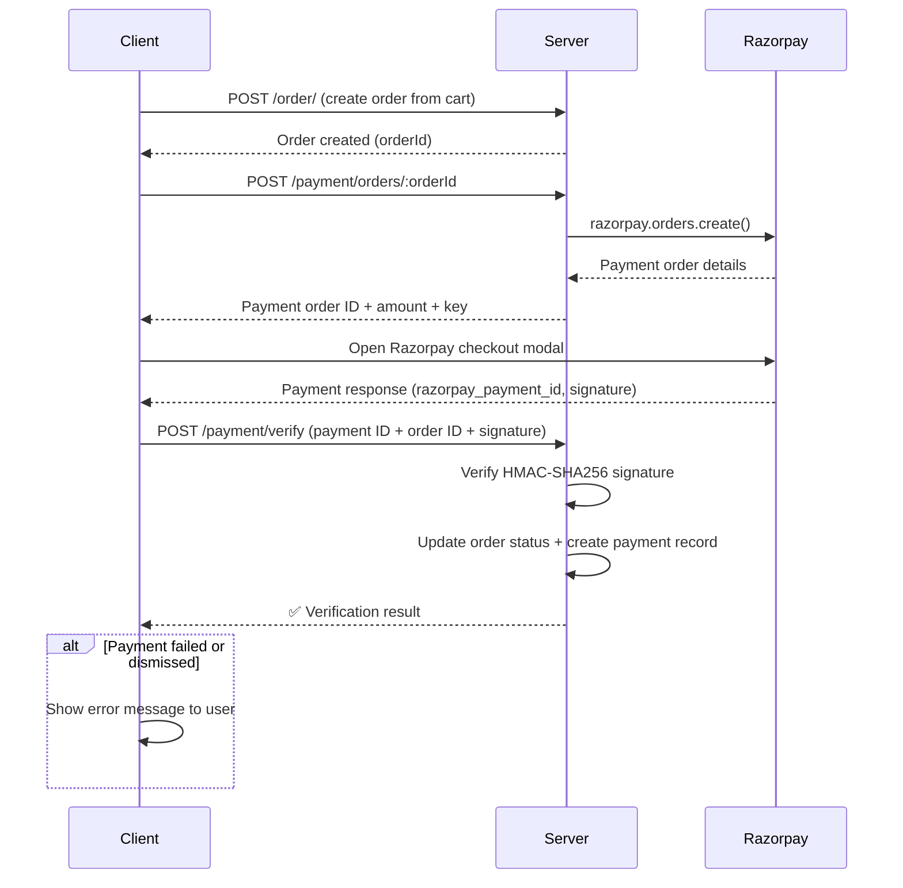

<div align="center">

# 🛒 SynXShop

### Modern Full-Stack E-Commerce Platform

A production-ready e-commerce application featuring role-based access control, seller product management with cloud-hosted images, and secure Razorpay payment integration.

🌐 **[Live Demo](https://e-commerce-two-neon-23.vercel.app/)**

<br/>


<br/>

[Live Demo](https://e-commerce-two-neon-23.vercel.app/) · [Getting Started](#-getting-started) · [API Reference](#-api-reference) · [Architecture](#-architecture) · [Contributing](#-contributing)

</div>

<br/>

<!-- Add screenshots to docs/screenshots/ and reference them here.
<div align="center">
  
</div>
-->

---

## 📋 Table of Contents

- [Overview](#-overview)
- [Features](#-features)
- [Tech Stack](#-tech-stack)
- [Architecture](#-architecture)
- [Project Structure](#-project-structure)
- [Getting Started](#-getting-started)
  - [Prerequisites](#prerequisites)
  - [Installation](#installation)
  - [Environment Variables](#environment-variables)
  - [Running Locally](#running-locally)
- [Available Scripts](#-available-scripts)
- [API Reference](#-api-reference)
- [Authentication Flow](#-authentication-flow)
- [Payment Flow](#-payment-flow)
- [Deployment](#-deployment)
- [Security](#-security)
- [Troubleshooting](#-troubleshooting)
- [Known Limitations](#-known-limitations)
- [Development Workflow](#-development-workflow)
- [Contributing](#-contributing)
- [Documentation](#-documentation)
- [License](#-license)

---

## 🔍 Overview

SynXShop is a full-stack e-commerce application built around **three user roles** — `USER`, `SELLER`, and `ADMIN`.

- **Buyers** browse and search products, manage a shopping cart and address book, place orders, and pay securely through Razorpay.
- **Sellers** list products with up to 5 images (hosted on Cloudinary), manage their catalog, and track listings.
- **Admins** access a dedicated dashboard for platform-wide oversight.

The frontend is a **React 19 + Vite** single-page application styled with **Tailwind CSS 4** and **shadcn/ui**. The backend is an **Express 5 + MongoDB** REST API with JWT-based authentication, Cloudinary integration, and Razorpay payment processing.

---

## ✨ Features

### 👤 All Users
- Register and log in with JWT access & refresh tokens (httpOnly cookies)
- Browse, search, and filter products with paginated results
- Product detail pages with multi-image carousels

### 🛍️ Buyers
- **Shopping Cart** — Add, update quantities, and remove items
- **Orders** — Create from cart, view history, get details, cancel
- **Checkout** — Razorpay integration with server-side signature verification
- **Address Book** — Manage up to 5 saved addresses
- **Profile** — Update account details and change password

### 📦 Sellers
- Upgrade a user account to the seller role
- Add products with up to 5 images (uploaded to Cloudinary via multer)
- View product listings and delete products (including Cloudinary cleanup)

### 🔧 Admin
- Dedicated admin panel with dashboard, features, products, and orders views
- Role-based route protection on both client and server

---

## 🧰 Tech Stack

| Layer        | Technologies                                                                  |
| ------------ | ----------------------------------------------------------------------------- |
| **Frontend** | React 19, Vite 8, Tailwind CSS 4, Redux Toolkit, React Router 7, Axios       |
| **UI**       | shadcn/ui, Radix UI, Lucide Icons, Tabler Icons, Embla Carousel, Sonner       |
| **Backend**  | Node.js (≥20), Express 5, Mongoose 9 (MongoDB), JWT, bcrypt, multer          |
| **Services** | Cloudinary (image hosting), Razorpay (payments)                               |
| **Tooling**  | Nodemon, ESLint 10, Prettier, sharp (image optimization)                      |

---

## 🏗 Architecture


```mermaid
flowchart LR
    subgraph Client["🖥️ Client (port 5173)"]
        React["React 19 + Vite"]
        Redux["Redux Toolkit"]
        Router["React Router"]
    end

    subgraph Server["⚙️ Server (port 8000)"]
        API["Express 5 API"]
        Auth["JWT Auth Middleware"]
        Upload["Multer File Upload"]
    end

    subgraph Data["💾 Data & Services"]
        DB[("MongoDB via Mongoose")]
        Cloud["☁️ Cloudinary"]
        RZP["💳 Razorpay"]
    end

    React --> Redux
    React --> Router
    Client -- "REST /api/v1 (httpOnly cookies)" --> API
    API --> Auth
    API --> Upload
    API --> DB
    Upload --> Cloud
    API --> RZP
    Client -. "Razorpay checkout modal" .-> RZP
```

---

## 📁 Project Structure

```text
e-Commerce/
├── client/                      # React + Vite frontend
│   └── src/
│       ├── api/                 # Axios instance, base URL, response interceptors
│       ├── app/                 # Redux store configuration
│       ├── assets/              # Images, logos, SVGs
│       ├── components/
│       │   ├── admin/           # Admin panel layout, header, sidebar
│       │   ├── auth/            # Auth layout wrapper
│       │   ├── common/          # CommonForm, ProtectedRoute
│       │   ├── seller/          # Seller layout, product cards, image upload
│       │   ├── shopping/        # Shopping layout, filters, header, footer
│       │   └── ui/              # shadcn/ui primitives (button, card, dialog, etc.)
│       ├── config/              # Form field configurations
│       ├── features/            # Redux slices & thunks
│       │   ├── auth/            #   ├── authSlice.js, authThunk.js
│       │   ├── seller/          #   ├── productSlice.js
│       │   └── shopping/        #   └── productSlice.js
│       ├── lib/                 # Utility functions (cn helper)
│       ├── pages/               # Route-level screens
│       │   ├── admin/           #   ├── Dashboard, Features, Products, Orders
│       │   ├── auth/            #   ├── Login, Register
│       │   ├── error/           #   ├── NotFound, UnAuthPage
│       │   ├── seller/          #   ├── ProductSeller
│       │   └── shopping/        #   └── Home, Products, ProductDetail, Checkout, Account
│       ├── App.jsx              # Route definitions
│       └── main.jsx             # Entry point
│
├── server/                      # Express API (off-limits to frontend agents)
│   └── src/
│       ├── controllers/         # Request handlers (auth, user, product, cart, order, payment)
│       ├── db/                  # MongoDB connection
│       ├── middleware/          # JWT verification, error handler, file upload (multer)
│       ├── models/              # Mongoose schemas (user, product, cart, order, payment, etc.)
│       ├── routes/              # Route definitions per resource
│       ├── services/            # Razorpay SDK wrapper
│       ├── utils/               # Error/response helpers, Cloudinary helpers
│       ├── app.js               # Express app (middleware, routes, CORS)
│       ├── constants.js         # App constants (DB_NAME)
│       └── index.js             # Entry point (DB connect → server listen)
│
├── docs/                        # Project documentation
│   ├── api-endpoints.md         # Full API reference
│   ├── architecture.md          # Architecture notes
│   └── folder_structure.md      # Complete directory tree
│
└── Readme.md
```

> 📄 For the complete file-by-file tree, see [`docs/folder_structure.md`](docs/folder_structure.md).

---

## 🚀 Getting Started

### Prerequisites

| Requirement       | Minimum Version | Notes                                    |
| ----------------- | --------------- | ---------------------------------------- |
| **Node.js**       | 20 LTS          | Required for Express 5 + ESM support     |
| **npm**           | 10+             | Comes with Node.js                       |
| **MongoDB**       | 6.0+            | Local install or [MongoDB Atlas][atlas]   |
| **Cloudinary**    | —               | [Free account][cloudinary] for images     |
| **Razorpay**      | —               | [Test-mode keys][razorpay] for dev        |

[atlas]: https://www.mongodb.com/cloud/atlas
[cloudinary]: https://cloudinary.com/
[razorpay]: https://razorpay.com/

### Installation

```bash
# Clone the repository
git clone <repository-url>
cd e-Commerce

# Install backend dependencies
cd server
npm install

# Install frontend dependencies
cd ../client
npm install
```

### Environment Variables

Create a `server/.env` file from the template below. **Never commit real credentials.**

```dotenv
# ─── Server ───────────────────────────────────────────
PORT=8000
MONGODB_URI=mongodb://localhost:27017/e-commerce
CORS_ORIGIN=http://localhost:5173

# ─── JWT ──────────────────────────────────────────────
ACCESS_TOKEN_SECRET=your-access-token-secret
ACCESS_TOKEN_EXPIRY=15m
REFRESH_TOKEN_SECRET=your-refresh-token-secret
REFRESH_TOKEN_EXPIRY=7d

# ─── Cloudinary ───────────────────────────────────────
CLOUDINARY_CLOUD_NAME=your-cloud-name
CLOUDINARY_API_KEY=your-api-key
CLOUDINARY_API_SECRET=your-api-secret

# ─── Razorpay ─────────────────────────────────────────
RAZORPAY_KEY_ID=rzp_test_xxxxxxxxxxxxx
RAZORPAY_KEY_SECRET=your-razorpay-secret
```

<details>
<summary><strong>📖 Variable reference</strong></summary>

| Variable                     | Description                                                                                       |
| ---------------------------- | ------------------------------------------------------------------------------------------------- |
| `PORT`                       | Server listen port (defaults to `8000`)                                                           |
| `MONGODB_URI`                | MongoDB connection string (local or Atlas)                                                        |
| `CORS_ORIGIN`                | Allowed client origin. Must be the exact origin (not `*`) because the client sends credentials    |
| `ACCESS_TOKEN_SECRET`        | Secret for signing JWT access tokens                                                              |
| `ACCESS_TOKEN_EXPIRY`        | Access token lifetime (e.g., `15m`, `1h`)                                                         |
| `REFRESH_TOKEN_SECRET`       | Secret for signing JWT refresh tokens                                                             |
| `REFRESH_TOKEN_EXPIRY`       | Refresh token lifetime (e.g., `7d`, `30d`)                                                        |
| `CLOUDINARY_CLOUD_NAME`      | Your Cloudinary cloud name                                                                        |
| `CLOUDINARY_API_KEY`         | Your Cloudinary API key                                                                           |
| `CLOUDINARY_API_SECRET`      | Your Cloudinary API secret                                                                        |
| `RAZORPAY_KEY_ID`            | Razorpay key ID (use `rzp_test_*` for development)                                                |
| `RAZORPAY_KEY_SECRET`        | Razorpay key secret                                                                               |

> **Note:** The client reads no environment variables. Its API base URL is hardcoded in `client/src/api/api.js`. The MongoDB database name is defined in `server/src/constants.js` as `E-COM`.

</details>

### Running Locally

Open two terminal windows:

```bash
# Terminal 1 — Start the backend
cd server
npm run dev
```

```bash
# Terminal 2 — Start the frontend
cd client
npm run dev
```

| Service    | URL                           |
| ---------- | ----------------------------- |
| Frontend   | http://localhost:5173          |
| Backend    | http://localhost:8000          |
| API Base   | http://localhost:8000/api/v1   |

---

## 📜 Available Scripts

### Server (`server/`)

| Command           | Description                                              |
| ----------------- | -------------------------------------------------------- |
| `npm run dev`     | Start the API with Nodemon (hot-reload on file changes)  |
| `npm start`       | Start the API in production mode (no hot-reload)         |

### Client (`client/`)

| Command           | Description                                   |
| ----------------- | --------------------------------------------- |
| `npm run dev`     | Start the Vite dev server with HMR             |
| `npm run build`   | Create an optimized production build           |
| `npm run preview` | Preview the production build locally           |
| `npm run lint`    | Run ESLint across the codebase                 |

---

## 📡 API Reference

**Base URL:** `http://localhost:8000/api/v1`  
🔒 = Requires JWT authentication (httpOnly cookie)

> For the full reference with request/response schemas, see [`docs/api-endpoints.md`](docs/api-endpoints.md).

<details>
<summary><strong>Auth</strong> — <code>/auth</code></summary>

| Method | Endpoint           | Auth | Description                                |
| ------ | ------------------ | ---- | ------------------------------------------ |
| POST   | `/auth/register`   | —    | Register a new user                        |
| POST   | `/auth/login`      | —    | Log in (tokens returned as httpOnly cookies) |
| POST   | `/auth/logout`     | 🔒   | Log out and clear tokens                   |
| POST   | `/auth/refresh`    | —    | Issue a new access + refresh token pair    |
| GET    | `/auth/check-auth` | 🔒   | Verify authentication status               |

</details>

<details>
<summary><strong>Users</strong> — <code>/users</code></summary>

| Method | Endpoint             | Auth | Description                   |
| ------ | -------------------- | ---- | ----------------------------- |
| GET    | `/users/me`          | 🔒   | Get current user's profile    |
| PATCH  | `/users/me`          | 🔒   | Update account details        |
| PATCH  | `/users/me/password` | 🔒   | Change password               |
| PATCH  | `/users/me/role`     | 🔒   | Upgrade role to `SELLER`      |

</details>

<details>
<summary><strong>Addresses</strong> — <code>/addresses</code></summary>

| Method | Endpoint                | Auth | Description                     |
| ------ | ----------------------- | ---- | ------------------------------- |
| POST   | `/addresses/add`        | 🔒   | Add an address (max 5)          |
| GET    | `/addresses/`           | 🔒   | List addresses (paginated)      |
| GET    | `/addresses/:addressId` | 🔒   | Get an address by ID            |
| PATCH  | `/addresses/:addressId` | 🔒   | Update an address               |
| DELETE | `/addresses/:addressId` | 🔒   | Delete an address               |

</details>

<details>
<summary><strong>Products — Shop</strong> — <code>/shop</code></summary>

| Method | Endpoint           | Auth | Description                              |
| ------ | ------------------ | ---- | ---------------------------------------- |
| GET    | `/shop/products`   | —    | List products (search, filter, paginate) |
| GET    | `/shop/:productId` | —    | Get product details                      |

</details>

<details>
<summary><strong>Seller</strong> — <code>/seller</code></summary>

| Method | Endpoint                        | Auth | Description                                |
| ------ | ------------------------------- | ---- | ------------------------------------------ |
| POST   | `/seller/products/add`          | —    | Add a product with images (multipart)      |
| GET    | `/seller/products`              | —    | List the seller's products                 |
| DELETE | `/seller/products/:productId`   | —    | Delete a product and its Cloudinary images |

</details>

<details>
<summary><strong>Cart</strong> — <code>/cart</code></summary>

| Method | Endpoint           | Auth | Description                  |
| ------ | ------------------ | ---- | ---------------------------- |
| GET    | `/cart/`           | 🔒   | Get cart contents            |
| POST   | `/cart/:productId` | 🔒   | Add a product to the cart    |
| PATCH  | `/cart/:productId` | 🔒   | Reduce product quantity      |
| DELETE | `/cart/:productId` | 🔒   | Remove a product from cart   |

</details>

<details>
<summary><strong>Orders</strong> — <code>/order</code></summary>

| Method | Endpoint                 | Auth | Description              |
| ------ | ------------------------ | ---- | ------------------------ |
| POST   | `/order/`                | 🔒   | Create order from cart   |
| GET    | `/order/`                | 🔒   | List the user's orders   |
| GET    | `/order/:orderId`        | 🔒   | Get order details        |
| PATCH  | `/order/:orderId/cancel` | 🔒   | Cancel an order          |

</details>

<details>
<summary><strong>Payments</strong> — <code>/payment</code></summary>

| Method | Endpoint                   | Auth | Description                       |
| ------ | -------------------------- | ---- | --------------------------------- |
| POST   | `/payment/orders/:orderId` | 🔒   | Create a Razorpay payment order   |
| POST   | `/payment/verify`          | 🔒   | Verify Razorpay payment signature |

</details>

---

## 🔐 Authentication Flow


```mermaid
sequenceDiagram
    participant U as User
    participant C as Client (React)
    participant S as Server (Express)

    U->>C: Submit login form
    C->>S: POST /auth/login
    S-->>C: Set httpOnly cookies (accessToken + refreshToken)
    C->>C: Store user data in Redux

    Note over C,S: On subsequent requests...
    C->>S: API request (cookies sent automatically)
    S->>S: verifyJWT middleware validates accessToken
    S-->>C: Response data

    Note over C,S: When access token expires...
    C->>S: API request → 401 Unauthorized
    C->>S: POST /auth/refresh (refresh cookie)
    S-->>C: New token pair (httpOnly cookies)
    C->>S: Retry original request
```

1. The user registers or logs in → server returns `accessToken` and `refreshToken` as **httpOnly cookies**.
2. The client sends cookies with every request (`withCredentials: true`).
3. The `verifyJWT` middleware validates the access token on protected routes.
4. On a `401`, the Axios response interceptor calls `/auth/refresh` to obtain a new token pair.
5. If the refresh also fails, client state is cleared and the user is redirected to the login page.

---

## 💳 Payment Flow


```mermaid
sequenceDiagram
    participant C as Client
    participant S as Server
    participant R as Razorpay

    C->>S: POST /order/ (create order from cart)
    S-->>C: Order created (orderId)

    C->>S: POST /payment/orders/:orderId
    S->>R: razorpay.orders.create()
    R-->>S: Payment order details
    S-->>C: Payment order ID + amount + key

    C->>R: Open Razorpay checkout modal
    R-->>C: Payment response (razorpay_payment_id, signature)

    C->>S: POST /payment/verify (payment ID + order ID + signature)
    S->>S: Verify HMAC-SHA256 signature
    S->>S: Update order status + create payment record
    S-->>C: ✅ Verification result

    alt Payment failed or dismissed
        C->>C: Show error message to user
    end
```

> **Important:** Only show a success state to the user after `/payment/verify` returns successfully. Handle dismissed checkout, failed payment, and failed verification with clear error messages.

---

## 🌐 Deployment

<details>
<summary><strong>General deployment notes</strong></summary>

### Frontend (Static SPA)

Build the production bundle:

```bash
cd client
npm run build
```

The output is in `client/dist/`. Deploy to any static hosting provider (Vercel, Netlify, Cloudflare Pages, etc.).

**SPA routing:** Configure your hosting to redirect all routes to `index.html` (Vercel config already exists for this).

**API base URL:** Before deploying, update the hardcoded base URL in `client/src/api/api.js` to point to your production API.

### Backend (Node.js)

- Set all environment variables from the `.env` template on your hosting provider.
- Update `CORS_ORIGIN` to match your production frontend URL.
- Use `npm start` (not `npm run dev`) in production.
- Ensure your MongoDB instance is accessible from the server.
- Use a reverse proxy (nginx, Caddy) or platform-managed TLS for HTTPS.

### Checklist

- [ ] All environment variables set on the server
- [ ] `CORS_ORIGIN` matches the deployed frontend URL
- [ ] API base URL updated in `client/src/api/api.js`
- [ ] MongoDB accessible from the server
- [ ] Razorpay keys switched from test to live mode
- [ ] HTTPS configured

</details>

---

## 🔒 Security

| Concern                 | Implementation                                                                |
| ----------------------- | ----------------------------------------------------------------------------- |
| **Token storage**       | JWTs stored in httpOnly cookies — never exposed to client-side JavaScript      |
| **Password hashing**    | bcrypt with automatic salt rounds                                             |
| **Payment verification**| Server-side HMAC-SHA256 signature verification using `RAZORPAY_KEY_SECRET`    |
| **CORS**                | Strict origin policy — `CORS_ORIGIN` must be an exact origin, not `*`         |
| **Secrets management**  | All secrets in `server/.env` — never committed to version control             |
| **Route protection**    | JWT middleware on server + `ProtectedRoute` component on client               |

---

## 🔧 Troubleshooting

<details>
<summary><strong>Common issues</strong></summary>

### CORS errors in the browser

- Ensure `CORS_ORIGIN` in `server/.env` exactly matches the client URL (e.g., `http://localhost:5173` — no trailing slash).
- Verify the server is running and accessible.

### 401 Unauthorized on every request

- Check that `withCredentials: true` is set in the Axios instance (`client/src/api/api.js`).
- Ensure cookies are being set correctly (check the browser's Application → Cookies tab).
- Verify `ACCESS_TOKEN_SECRET` and `REFRESH_TOKEN_SECRET` are set in `.env`.

### Images not uploading

- Verify all three Cloudinary variables (`CLOUD_NAME`, `API_KEY`, `API_SECRET`) are set correctly.
- Check that the file size is within Cloudinary's free-tier limits.
- Ensure `server/public/temp/` directory exists (multer writes temporary files here).

### MongoDB connection failures

- Confirm `MONGODB_URI` is correct and the MongoDB instance is running.
- For Atlas: ensure your IP is whitelisted and the connection string includes the database name.

### Razorpay checkout not opening

- Verify `RAZORPAY_KEY_ID` is set and starts with `rzp_test_` (for development).
- Check the browser console for script loading errors.

### `npm run build` fails

- Run `npm run lint` first to catch syntax errors.
- Ensure all dependencies are installed (`npm install` in `client/`).

</details>

---

## ⚠️ Known Limitations

| Area               | Limitation                                                                                    |
| ------------------ | --------------------------------------------------------------------------------------------- |
| **Reviews**        | Controller exists but no routes are registered — reviews are unreachable via API               |
| **Admin API**      | Admin panel views exist on the frontend, but no admin API endpoints are implemented            |
| **Product editing**| Sellers can add, list, and delete products, but there is no product **edit** endpoint          |
| **Seller auth**    | Seller routes are documented without JWT protection — don't assume they are secured            |
| **API base URL**   | Hardcoded in `client/src/api/api.js` — must be updated manually before non-local deployments  |

---

## 🔀 Development Workflow

```text
main (stable)
 └── develop (integration)
      └── feature/* (e.g., feature/cart, feature/wishlist)
```

1. Create a feature branch from `develop`: `git checkout -b feature/my-feature develop`
2. Make changes and commit with [conventional commits](https://www.conventionalcommits.org/)
3. Open a pull request from `feature/*` → `develop`
4. After review and merge, changes flow `develop` → `main` through a release PR

---

## 🤝 Contributing

Contributions are welcome! Please follow these steps:

1. **Fork** the repository
2. **Create** a feature branch (`git checkout -b feature/amazing-feature`)
3. **Commit** your changes using [conventional commits](https://www.conventionalcommits.org/)
4. **Push** to your fork (`git push origin feature/amazing-feature`)
5. **Open** a Pull Request against `develop`

### Guidelines

- Follow the existing code style and folder structure
- Ensure `npm run lint` and `npm run build` pass before submitting
- Include loading, error, and empty states for new UI features
- Keep PRs focused — one feature or fix per PR
- Update documentation if you change the project structure

---

## 📚 Documentation

| Document                                                    | Description                   |
| ----------------------------------------------------------- | ----------------------------- |
| [`docs/api-endpoints.md`](docs/api-endpoints.md)           | Full API endpoint reference   |
| [`docs/architecture.md`](docs/architecture.md)              | Architecture notes            |
| [`docs/folder_structure.md`](docs/folder_structure.md)      | Complete directory tree        |

---

## 📄 License

This project is licensed under the **ISC License**. See the server's `package.json` for details.

---

<div align="center">

**Built with ❤️ by [Jyotish](https://github.com/jyotish)**

[⬆ Back to Top](#-synxshop)

</div>
